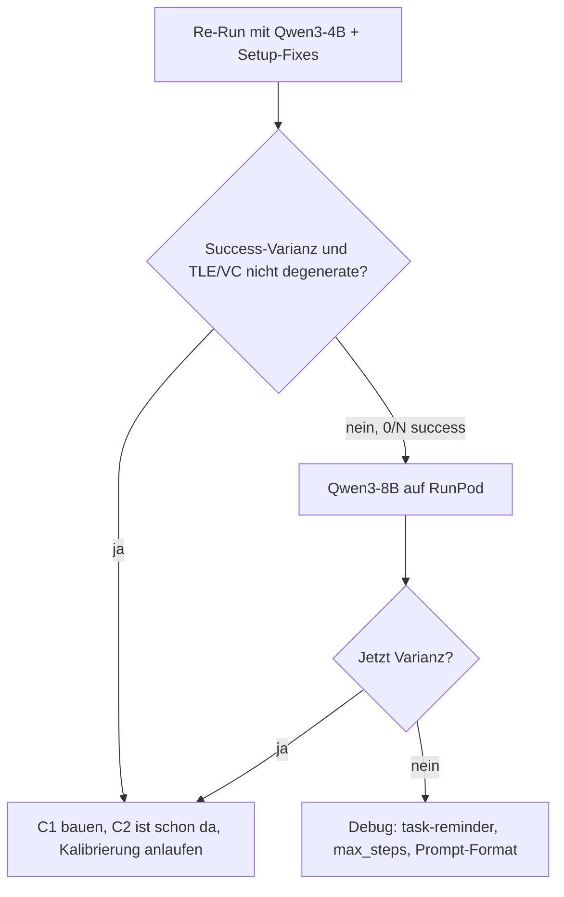

## Diagnose (kurz)

C0-Baseline-Run mit Llama-3.2-3B-Instruct-4bit in LM Studio:

- Langfuse-Trace zeigt: 5/10 Steps in Bedroom mit `look`/`examine bed`-Loops, dann Navigation bis Kitchen (step 8), und direktes Rauslaufen aus der Kitchen (step 9–10) ohne Cookbook-Interaktion.
- Ursache ist **gemischt**: das 3B-Modell ist schwach, aber drei **Setup-Bugs** sorgen dafür, dass die Kalibrierung per Konstruktion degenerate ist (keine Success-Varianz gegen TLE/VC kalibrierbar):
  1. [configs/pilot.yaml](configs/pilot.yaml) Zeile 95 `max_env_steps: 10` — TextWorld-Cooking braucht realistisch 15–30 Steps; README schreibt selbst "20–25".
  2. [configs/lmstudio_config.yaml](configs/lmstudio_config.yaml) Zeile 19 überschreibt `instances: 1` + `runs_per_instance: 1` → 1 Episode pro Stage. Für ECE-Bins braucht's N ≥ ~15–20.
  3. Step-Prompt enthält keinen wiederholten Task-Reminder — das Cooking-Goal driftet in wachsender History in den Hintergrund. Prefix in [configs/pilot.yaml](configs/pilot.yaml) Zeile 50–56 beschreibt nur das Parser-Interface.
- ToH `parse_rate=1.00` ist nur Format-Check, kein Solve-Check; nur 1 Episode gelaufen.

Modellkapazität ist ein separater Effekt — aber erst lösbar, nachdem das Setup nicht mehr im Weg steht.

## Vorgehen (in dieser Reihenfolge)

### 1. Setup-Fixes (ohne Code-Umbau, nur Konfig + Prompt)

- [configs/pilot.yaml](configs/pilot.yaml) `test4_textworld.max_env_steps: 10 → 25`. Gym cap matcht dann die README-Empfehlung.
- [configs/pilot.yaml](configs/pilot.yaml) `tower_of_hanoi.pilot_episodes: 20` lassen, aber [configs/lmstudio_config.yaml](configs/lmstudio_config.yaml) `tower_of_hanoi.pilot_episodes: 1 → 10` heben, damit LM-Studio-Overlay ToH-Kalibrierung nicht mehr killt.
- [configs/lmstudio_config.yaml](configs/lmstudio_config.yaml) `pilot.instances: 1 → 5` (nutzt alle Instanzen, sobald generiert) und `runs_per_instance: 1 → 2`. Ergibt 5×3×2 = 30 Episoden pro Stage-Mix, 10 pro Stage — genug für erste ECE-Sicht.
- [configs/pilot.yaml](configs/pilot.yaml) `domain_prompts.textworld.prefix` ergänzen um einen expliziten Task-Reminder, der bei jedem Step im Prompt steht. Beispielerweiterung (immutable Task-Hint, nicht domain-spezifisches Cheating):

```yaml
domain_prompts:
  textworld:
    prefix: >
      You are playing a parser-based text adventure (interactive fiction). Your overall
      task, restated every turn: read the cookbook in the kitchen, gather the listed
      ingredients, prepare the meal, and eat it. Base each reply on the latest game text.
      Output exactly one imperative command on a single line—typical forms include movement
      (go north), looking (look), and object use (take knife, open door). Do not add
      narration, quotes, role-play, multiple commands, or reasoning. If the text includes
      a line starting with "Valid commands this turn:", choose one of those commands when
      possible. Avoid repeating an action that produced no visible change.
```

Kein expliziter Loop-Guard im Code (User-Entscheidung `none`) — der Prompt-Hinweis "avoid repeating an action that produced no visible change" übernimmt das weich.

### 2. TextWorld-Instanzen generieren (für N=5)

- Aktuell existiert nur `textworld_0.z8`. Mit `scripts/generate_textworld_games.py` vier weitere erzeugen:

```bash
python scripts/generate_textworld_games.py \
  --num-rooms 5 --num-ingredients 2 --cook \
  --seed 42 --num-instances 5
```

Überschreibt `textworld_0..4.z8` deterministisch mit festem Master-Seed. Danach passen die 5 Instanzen zu `pilot.instances: 5`.

### 3. Re-Run mit Qwen3-4B-Instruct (LM Studio)

- In LM Studio das Modell `lmstudio-community/Qwen3-4B-Instruct-2507-MLX-4bit` laden (steht schon in [configs/models.yaml](configs/models.yaml) Zeile 16).
- `configs/lmstudio_config.yaml` `model.name` entsprechend setzen.
- Pilot-Run:

```bash
python scripts/run_pilot.py --config configs/pilot.yaml \
  --output-dir data/results --pilot-mode lmstudio
```

- Erwartete Wall-Time: ~5–10 min (30 TextWorld-Episoden × ~15–25 Steps × ~1s + ToH 10 × 20 Steps). Output unter `data/results/pilot_<ts>/`.

### 4. Auswertung (bestimmt, ob Schritt 5 nötig ist)

Kalibrierungs-Check pro Stage (C0, C1, C2) aus `data/results/pilot_*/` heraus:

- **Success-Varianz**: mindestens eine Episode pro Stage mit `task_success=True`. Bei weiter 0/10 → Modell wirklich zu klein, weiter zu Schritt 5. Bei 2–8/10 → Kalibrierung möglich, weiter zu Schritt 6.
- **TLE-Verteilung** über Schritte: Mittelwert + Spreizung. Degenerate-Signal wäre z. B. TLE ≈ constant.
- **VC-Verteilung** (`vc/ep_*_vc.json`): sollte nicht konstant 0 oder 100 sein.
- **ECE** via vorhandene `src/analysis/calibration.py` auf `pilot_feasibility.json`-Daten.
- Langfuse-Trace-Stichprobe: sieht Episode >5 Steps anders aus als die aktuelle? Wird Kitchen tatsächlich genutzt?

### 5. (Conditional) RunPod / Qwen3-8B

Nur falls Schritt 4 zeigt, dass Qwen3-4B C0 immer noch keine Success-Varianz erzeugt:

- `configs/pilot.yaml` `model.name: "Qwen/Qwen3-8B"` (oder anderen 8B-Kandidaten aus `blueprints/thesis_dependency_map.html`).
- RunPod nach README-Abschnitt "Running on RunPod Cloud GPU" starten, Pilot mit `--pilot-mode cuda` laufen lassen.
- Ergebnisse via `scripts/download_runpod_results.sh` zurückziehen, dieselbe Auswertung wie Schritt 4.

### 6. Tower of Hanoi-Review

Unabhängig von 1–5, nach dem ersten Re-Run:

- ToH-Episoden-JSONs ansehen: Success-Rate (nicht nur parse_rate), Entscheidungs-Pattern bei 3-Disk-Problem.
- Falls Success-Rate < 20 % bei 3 Disks, Prompt in [configs/pilot.yaml](configs/pilot.yaml) Zeile 59–66 prüfen (Modell verwechselt evtl. Disk-Nummern vs. Peg-Buchstaben) — dort gibt es schon eine explizite "Do not use disk numbers" Zeile, aber das ist ein bekannter 3B-Attacker.

### 7. Erst jetzt: C1 (CoT + Verify) bauen

[src/agent/compute_stages.py](src/agent/compute_stages.py) Zeile 301–307 zeigt, dass `c1_step` aktuell nur `c0_step` aliast — das ist ein **Stub**. Bevor C2 richtig auswertbar ist, braucht C1 einen realen CoT+Verify-Zweikall. Designansatz nach [blueprints/thesis_design.md](blueprints/thesis_design.md) Zeile 166:

1. Erster Call: "Think step by step, then answer with ACTION: <command>".
2. Zweiter Call (Self-Verify): "Is the action <X> consistent with the task and state? Answer ACTION: <command> or ACTION: <revised>".
3. TLE/VC auf dem zweiten (finalen) Call.

Implementierung folgt `_c0_step_core`-Pattern in [src/agent/compute_stages.py](src/agent/compute_stages.py); Unit-Test ergänzen nach `tests/test_05_e2e_mini_experiment.py`-Vorbild.

## Entscheidungsmatrix (nach Schritt 4)



## Was NICHT im Plan ist

- Kein Code-Loop-Guard (User-Entscheidung `none`).
- Kein Umbau der History-Logik in [src/agent/base_agent.py](src/agent/base_agent.py) — Prompt-basierter Reminder reicht.
- Keine neue ECE-Metrik; bestehendes `src/analysis/calibration.py` nutzen.