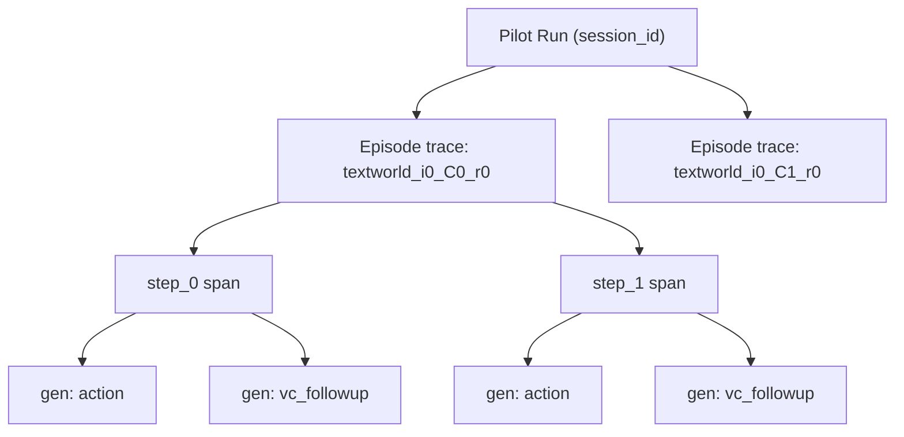

## Kontext / Ist-Zustand (Pilot 2026-04-23, Qwen3-4B-Instruct-2507-MLX-4bit, LM Studio)

- 5 Episoden (C0×2, C1×2, C2×1) auf `instance=0`, alle `task_success=False`, jeweils `steps=25` (Cap erreicht).
- Der von dir gepostete `step_24_C0`-Prompt entspricht Episode `ep_textworld_0_C0_0`. Aus der Trace: die letzten Schritte sind
  `20:look at cookbook(illegal) → 21:chop the lettuce(illegal) → 22:chop the lettuce with knife(illegal) → 23:chop the lettuce with knife(illegal) → 24:look around(illegal)`.
  → klassischer Loop, genau wie du es beschreibst.
- Bereits ein `optimal`-Signal bei Schritt 17 (`cook lettuce with stove`) — Modell findet also die Aktion, verliert aber danach den Thread.

---

## A. Action-Trail in der History-Weitergabe (bestätigt + Fix)

Deine Hypothese stimmt *teilweise*. Die Actions werden in [src/agent/base_agent.py](src/agent/base_agent.py) zwar angehängt (`history.append(f"ACTION: {action}")`, Z. 316), **aber** `_compact_history_for_prompt(history, keep_last_lines=8)` behält nur die letzten 8 Zeilen — bei ACTION/OBSERVATION-Paaren also nur 4 Turns. Auf Step 24 verlieren wir alles vor Step ~20. Das ist die wahrscheinliche Ursache für den `chop the lettuce with knife`-Loop: sobald „take knife" aus dem Fenster fällt, gibt es keine Erinnerung mehr, dass nie ein Messer aufgenommen wurde.

Zusätzlich: `_truncate_for_history(text, max_chars=1000)` killt in jeder Observation 50 %/50 % Head/Tail → das Rezept (erscheint nur einmal im Kochbuch) überlebt diese Truncierung nicht, wenn es nicht mehr im letzten Fenster ist.

### Plan A (gewählte Option: *expand window + full action-trail*)

1. **Neue Hilfsfunktion** `_compact_history_for_prompt` in [src/agent/base_agent.py](src/agent/base_agent.py) umbauen: akzeptiert zwei Parameter:
    - `keep_last_pairs: int` (default 12 für TextWorld, 8 für ToH) statt `keep_last_lines` — garantiert vollständige ACTION/OBS-Paare.
    - Immer: `history[0]` (opening scene) + letzte `keep_last_pairs` Paare.
2. **Truncierung asymmetrisch machen:**
    - ACTIONs sind immer kurz → **nie kürzen**.
    - OBSERVATIONs: `_truncate_for_history(..., max_chars=500, head_ratio=0.15)` → ASCII-Banner (Head) aggressiv wegschneiden, Tail (Feedback + Valid commands) komplett erhalten. Für die aktuellste Observation (Step-Input) `max_chars=2000`, um Rezept/Feedback nicht zu verlieren.
3. **Persistente „Pinned context"-Zeilen:** In `base_agent.run_episode/run_adaptive_episode` zusätzlich zum ersten Observation-Eintrag einen „pinned"-Slot, in dem der Recipe-Text hinterlegt wird, sobald `look at cookbook` eine Observation mit `Recipe #` zurückgibt. Implementation: nach jedem `env.step` prüfen, ob `Recipe #` in `obs` auftaucht → extrahieren (regex auf `Recipe #[\s\S]+?(?=\n\n|\Z)`) und als `PINNED RECIPE:` vor die letzten N Paare in der Prompt-Konstruktion einschieben (nicht in history selbst). Bleibt backend-agnostisch, keine neuen Dependencies.
4. **Parameter neu im Config** (`configs/pilot.yaml` → `domain_prompts.textworld`):
    - `history_keep_last_pairs: 12`
    - `history_max_obs_chars: 500`
    - `history_current_obs_max_chars: 2000`
    - `pin_recipe: true`
5. **Tests:** `tests/test_base_agent.py` um Fälle erweitern (pair-count, pinned recipe überlebt, ACTIONs nie truncated).

Schnipsel der aktuell problematischen Stelle:

```42:50:src/agent/base_agent.py
def _compact_history_for_prompt(history: list[str], *, keep_last_lines: int = 8) -> list[str]:
    """Return a compact history view for prompting (keeps first + last N lines)."""
    if not history:
        return []
    if keep_last_lines <= 0:
        return history[:1]
    if len(history) <= 1 + keep_last_lines:
        return list(history)
    return [history[0], *history[-keep_last_lines:]]
```

---

## B. Explizite Zielsetzung: Cookbook → Kochen → Essen → Win

Dein Eindruck ist korrekt. Der aktuelle Prefix in [configs/pilot.yaml](configs/pilot.yaml) (Z. 50–58) erwähnt zwar `"…prepare the meal, and then enjoy (eat) it."`, aber:

- **Das „win"-Konzept** ist nirgends explizit (`prepare meal` + `eat meal` ist die TextWorld-spezifische Abschlussbedingung — das Modell weiß das nicht).
- **Der Rucksack mit Kochbuch** ist nie erwähnt — das Modell weiß nicht, dass `inventory` direkt das Rezept offenbart.
- **Die Tool-Action-Mechanik** (man braucht Messer, Herd/Ofen; `chop X` allein funktioniert nicht, man muss `chop X with knife` tippen *und* das Messer im Inventar haben).

### Plan B — Prompt-Prefix-Überarbeitung (nur Config, kein Code)

In [configs/pilot.yaml](configs/pilot.yaml), Block `domain_prompts.textworld.prefix`:

```text
You are playing a parser-based text adventure. Your GOAL is to WIN the game.
You WIN when you have successfully prepared the recipe meal AND eaten it.

What you already have:
- You start with a backpack containing a cookbook with Recipe #1.
- Read the cookbook (e.g. `read cookbook` or `examine cookbook`) to see the ingredients and directions.

Core loop to win:
1. Read the cookbook to learn the recipe.
2. Gather listed ingredients (carry them in your inventory).
3. To chop/slice/dice an ingredient you MUST be holding a knife; use `chop X with knife`.
4. To fry/roast you need a stove/oven; use `cook X with stove` or `cook X with oven`.
5. After all directions are done, type `prepare meal`.
6. Finally type `eat meal` — this is how you win.

Rules for your output:
- Output exactly ONE imperative command on a single line. No reasoning, no quotes, no narration.
- If a line `Valid commands this turn:` appears, you MUST pick one of those commands verbatim.
- Do NOT repeat an action that produced no visible change. Try something different.
- Use `inventory` to recall what you carry, `look` to re-read the room.
```

Zusätzlich:

- `action_max_tokens: 32` bleibt.
- `action_stop: ["\n"]` bleibt.
- Kein Code-Change nötig; der Prefix fließt über [src/utils/step_config.py](src/utils/step_config.py) in `get_step_fn`.

Eine separate, gedruckte „EVAL-Notiz" im Plan: wir dokumentieren, dass diese Prompt-Variante *nicht* ins Hauptexperiment einfließt, ohne dass die Calibration Runs nachgezogen werden — d.h. alle Phase-1-Daten müssten mit derselben Prompt-Version erhoben werden. Für den Pilot 2026-04-23 ist das OK (noch keine produktiven Zahlen), für Phase 1 ist das ein Lock-Point.

---

## C. Langfuse-Tracing — aktueller Zustand + sinnvoller Ausbau

### Ist-Zustand ([src/utils/tracing.py](src/utils/tracing.py))

- Pro Episode: ein **Root-Span** (`metacog_episode`) mit fester `trace_id` via `create_trace_id()` + `TraceContext`.
- Pro Env-Step: ein **Generation-Observation** `step_{i}_{C0|C1|C2}` unter derselben `trace_id`.
- Metadata: `compute_stage`, `model`, `episode_id` am Root; pro Step `tle`, `vc`, `correctness`, `tokens_generated`, `lm_calls`.
- Zwei LM-Calls pro Step (action + vc follow-up) werden **nicht unterschieden** — nur die Action-Generation wird geloggt, der VC-Call taucht in `metadata` als Text, aber nicht als eigenes Generation-Objekt auf.
- **Keine** Session-ID, **keine** `tags`, **keine** `trace name`/`trace-level update`.

### Plan C — was konkret erweitern

Änderungen nur in [src/utils/tracing.py](src/utils/tracing.py) + kleine Prop-Weitergabe in [src/agent/base_agent.py](src/agent/base_agent.py):

1. **Trace-Level-Metadaten beim `episode_start`**: über `client.update_current_trace(...)` (Langfuse v3) setzen von
   - `name = f"textworld_i{instance}_{stage}_r{run}"` (sprechender Name in der UI)
   - `session_id = f"pilot_{pilot_run_id}"` (alle Episoden eines Pilots gruppieren)
   - `tags = ["pilot", "textworld", compute_stage, model_name, pilot_mode]`
   - `user_id = model_name` (nützlich zum Gruppieren im Langfuse-UI)
   - `input = first_observation[:500]`
2. **Saubere Span-Hierarchie pro Step**: nested Spans statt flachem Generation-Spam:
   ```
   trace (episode)
     └── span "step_{i}" (input=obs, metadata=tle/vc/correctness)
           ├── generation "action" (prompt, output, model, token_usage)
           └── generation "vc_followup" (prompt, output, model) — nur wenn vc_mode=followup
   ```
   Implementation: neue Methode `log_step(...)` im TraceHook die eine Step-Span öffnet und beide Generations darunter als Children erzeugt. C1/C2 bekommen darunter entsprechend `cot`, `verify`, `sample_1..N`-Child-Generations.
3. **`episode_end` erweitern**: `update_current_trace(output={"task_success": ..., "steps": ..., "total_lm_calls": ...})` + weitere Tags (`succeeded` / `failed`, `hit_step_cap`). Damit ist Filtern / Aggregieren in Langfuse trivial.
4. **Neue Hook-Signatur** (abwärtskompatibel über Kwargs):
   - `episode_start(episode_id, *, metadata, tags=None, session_id=None, trace_name=None)`
   - `log_step(step_index, *, stage, strategy=None, observation, action, prompt, action_output, vc_prompt=None, vc_output=None, metadata)`
   - `episode_end(*, output=None, final_tags=None)`
5. **run_pilot.py** baut `session_id` aus dem Ordnernamen (`pilot_20260423_141645`) und liefert `tags` mit.



Keine neuen Dependencies (langfuse ist schon optional drin).

---

## D. Agent-Framework-Evaluation (gewählt: evaluate only)

Ziel: begründete Empfehlung — aktuelle Eigenbau-Loop behalten oder wechseln — dokumentiert in einem neuen Abschnitt in [blueprints/thesis_design.md](blueprints/thesis_design.md) (oder eigener Datei `blueprints/framework_evaluation.md`).

### Argumente für Beibehaltung der Custom-Loop

- Die Thesis misst **pro Step**: TLE, VC, Tokens, LM-Calls, Stage-Allocation. Das erfordert White-Box-Zugriff auf genau den Punkt, an dem das Modell generiert. Custom-Loop kostet ~400 LOC und kontrolliert das exakt.
- Kein Framework braucht man für „observation → single LLM call → parsed action → env.step". Das ist kein echtes Multi-Tool-Agent-Setting.
- Framework-interne Memory-/Summary-Mechaniken (ConversationBufferMemory etc.) würden die **Input-Länge** als unabhängige Variable korrumpieren — gefährlich für Phase-2-Allokationsresultate.
- Reproducibility: Jeder LM-Call ist deterministisch reproduzierbar (gleicher Prompt + Seed).

### Kandidaten, die ich evaluiere

- **LangChain / LangGraph**: LangGraph als State-Machine wäre sauber, hat Langfuse-Integration out-of-the-box. Aber: Memory-Komponenten wollen sich einmischen; man müsste Zero-Memory-Nodes bauen — Aufwand ohne Mehrwert. Größter Risikofaktor: Version-Churn (LangChain wechselt APIs 2-3× pro Jahr) — schlecht für eine 6-Monats-Masterarbeit.
- **CrewAI**: multi-agent framework. Overkill, Memory nicht abschaltbar, Design auf Rollen/Crews hin gebaut, nicht auf „single agent, deep instrumentation".
- **smolagents** (HF): sehr leichtgewichtig, aber auf Code-Agent / Tool-Calling fokussiert. Passt nicht zu Parser-IF.
- **PydanticAI**: schöne Typen, aber neu und Framework-Risk.
- **TextWorld-Baselines** direkt: z. B. `textworld-express` / original `textworld-baselines` — ungeeignet, da RL-Training-Loops, nicht LLM-Inferenz.

### Empfehlung

- **Bleiben bei der Custom-Loop.** Als Hygienemaßnahme diese drei Dinge aus „Framework-Standards" übernehmen, ohne das Framework selbst:
  1. **OpenAI-`messages`-Liste** statt flachem String-Prompt (einfacher System-Prompt, klar getrennte Turns) — dünner Adapter in `_build_prompt`. Macht es trivial, später LangChain/LangGraph-Adapter zu schreiben, falls nötig.
  2. **Langfuse** als Tracing-Backend (schon vorhanden → Plan C verstärkt das).
  3. **pydantic**-basierte Step-Ergebnisstruktur statt dict + Tupel — reduziert die `_normalize_step_result`-Komplexität (aktuell 3/4/6/7/9-Tuple-Polymorphismus, siehe [src/agent/base_agent.py](src/agent/base_agent.py) Z. 53–122).

Punkt 1 & 3 sind *optionale* Hygiene-Refactors und nicht Teil des Pflicht-Plans — ich benenne sie als „Phase 0.5 Tech-Debt" und bewusst *nach* dem Pilot-Abschluss.

---

## E. Zusammenfassung der konkreten Änderungen (Reihenfolge)

1. **Config-only (minimal invasiv, sofort testbar):**
   - [configs/pilot.yaml](configs/pilot.yaml) → neuer TextWorld-Prefix (Plan B).
   - [configs/pilot.yaml](configs/pilot.yaml) → neue Keys `history_keep_last_pairs`, `history_max_obs_chars`, `history_current_obs_max_chars`, `pin_recipe` (Plan A).

2. **Code-Änderungen:**
   - [src/agent/base_agent.py](src/agent/base_agent.py): `_compact_history_for_prompt` auf Pair-Count, asymmetrische Truncation, optionaler `pinned_recipe`-Slot.
   - [src/utils/step_config.py](src/utils/step_config.py): neue Keys durchreichen.
   - [src/utils/tracing.py](src/utils/tracing.py): nested Spans, session_id, tags, `update_current_trace`, saubere trace output (Plan C).
   - [scripts/run_pilot.py](scripts/run_pilot.py): `session_id`/`tags`/`trace_name` an den Hook durchreichen.

3. **Tests aktualisieren:**
   - `tests/test_base_agent.py`: history-pair-count, pinned-recipe, action nie truncated.
   - Langfuse-Hook-Tests (falls vorhanden) an neue Signatur anpassen.

4. **Dokument:** neue Datei [blueprints/framework_evaluation.md](blueprints/framework_evaluation.md) mit Kurzbegründung (Plan D) — eine Thesis-Seite, reicht für den Methodenteil „Warum kein Framework".

5. **Pilot-Re-Run** mit identischer Konfig zur Verifikation (gleiche LM Studio Session, gleicher seed, gleiche Instance). Erwartete Effekte:
   - Loop-Rate (`illegal`-Anteil) sinkt (Plan A).
   - Mindestens ein Schritt Richtung `eat meal` bei mindestens einem C1/C2-Run (Plan B).
   - Langfuse-Dashboard zeigt gruppierte Sessions mit Tags (Plan C).

Nicht im Scope (bewusst ausgeschlossen):
- Framework-Migration (D = evaluate only).
- Umstellung auf `messages`-Listen (später).
- Änderungen am Allocator / Signal-Extraction — separate PR.