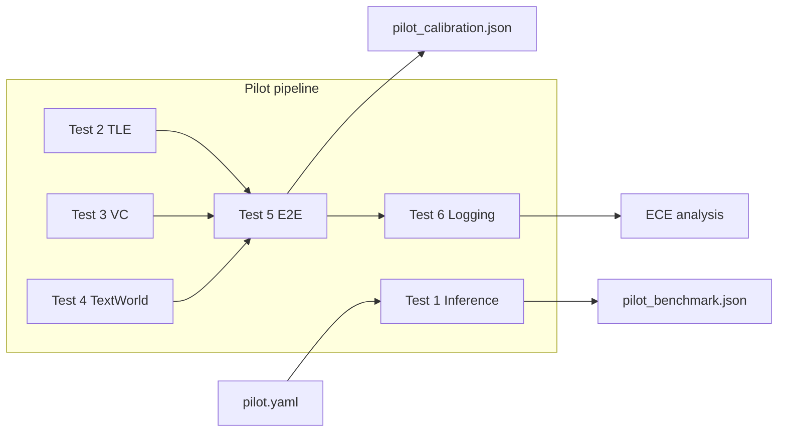

# Thesis project structure and pilot tests

## Scope

- **Source of truth:** [blueprints/infrastructureplan_pilot.md](blueprints/infrastructureplan_pilot.md) Section V (Pilot) and Section VI (Code-Struktur).
- **Repo:** Use current workspace `metacog-llm-compute` as project root (blueprint’s “thesis-metacognitive-allocation” is the suggested GitHub repo name only).
- **Deliverables:** (1) Full directory tree and stub files so the project is navigable and ready for implementation. (2) A `tests/` directory with pilot-aligned tests that run without GPU/cloud (mocks/skips where needed).

---

## 1. Directory and config layout

Create the exact structure from the blueprint:

```
configs/           → experiment_core.yaml, experiment_ext.yaml, pilot.yaml
src/
  agent/           → base_agent.py, compute_stages.py, allocator.py
  signals/         → token_entropy.py, verbalized_confidence.py, semantic_consistency.py
  environments/    → textworld_env.py, delayed_cue.py, logical_reasoning.py
  analysis/        → calibration.py, comparison.py, visualization.py
  utils/           → logging_utils.py, model_wrapper.py, checkpointing.py
scripts/           → run_pilot.py, run_phase1.py, run_phase2.py, setup_cloud.sh
data/
  tasks/           → .gitkeep (generated task instances)
  results/         → .gitkeep (JSON per episode)
```

Add `__init__.py` in `src`, `src/agent`, `src/signals`, `src/environments`, `src/analysis`, and `src/utils` so all are importable packages.

**Config stubs (YAML):**

- **pilot.yaml:** Model (Qwen2.5-3B), inference params (temperature 0.3, ~200 tokens), pilot-specific counts (e.g. 5 instances × 3 stages × 1 run = 15 episodes), output paths for `pilot_benchmark.json` and `pilot_calibration.json`.
- **experiment_core.yaml:** Phase 1/2 dimensions (2 domains, 3 compute stages, 5 runs, 50 instances per domain), paths for tasks and results.
- **experiment_ext.yaml:** Placeholder sections for extensions (semantic consistency, second model, third domain).

---

## 2. Source stubs (minimal interfaces)

Stubs will have docstrings and function/class signatures that match the blueprint; bodies can `pass` or return dummy data so imports and test wiring work.


| File                                                                           | Purpose (from blueprint)                                                     | Stub content                                                                                                                   |
| ------------------------------------------------------------------------------ | ---------------------------------------------------------------------------- | ------------------------------------------------------------------------------------------------------------------------------ |
| [src/agent/base_agent.py](src/agent/base_agent.py)                             | Minimal agent loop: observation → LM → action → next observation             | Class or function `run_episode(env, model, compute_stage, ...)` with clear signature; no framework deps.                       |
| [src/agent/compute_stages.py](src/agent/compute_stages.py)                     | C0 (direct + logprobs), C1 (CoT + verify), C2 (best-of-N)                    | Functions `c0_step`, `c1_step`, `c2_step` (or single dispatcher) taking prompt/context, returning action + optional TLE/VC.    |
| [src/agent/allocator.py](src/agent/allocator.py)                               | Rule-based allocator + baselines (Always-C0, Always-C2, Random, EAGer-style) | `allocate(signal, ...)` and baseline strategy selectors.                                                                       |
| [src/signals/token_entropy.py](src/signals/token_entropy.py)                   | TLE from vLLM logprobs                                                       | `compute_tle(logprobs)` or `extract_tle_from_response(...)` with entropy formula in docstring.                                 |
| [src/signals/verbalized_confidence.py](src/signals/verbalized_confidence.py)   | VC extraction and parsing                                                    | `parse_confidence(text)` returning numeric 0–100 or None; docstring for “Answer, then rate confidence 0–100” prompt.           |
| [src/signals/semantic_consistency.py](src/signals/semantic_consistency.py)     | SC (extension)                                                               | Stub only: e.g. `compute_semantic_consistency(...)` returning placeholder.                                                     |
| [src/environments/textworld_env.py](src/environments/textworld_env.py)         | TextWorld wrapper                                                            | Class with `reset()`, `step(action)`, `observation`, `done`; optional dependency guard for `textworld`.                        |
| [src/environments/delayed_cue.py](src/environments/delayed_cue.py)             | Delayed-cue task generator                                                   | `generate_tasks(n)` or similar returning task instances (e.g. list of dicts).                                                  |
| [src/environments/logical_reasoning.py](src/environments/logical_reasoning.py) | Logic puzzles (extension)                                                    | Stub only.                                                                                                                     |
| [src/analysis/calibration.py](src/analysis/calibration.py)                     | ECE, Brier, reliability diagrams                                             | `compute_ece(predictions, correctness)`, `compute_brier(...)` with clear signatures; docstrings.                               |
| [src/analysis/comparison.py](src/analysis/comparison.py)                       | Mixed-effects models                                                         | Stub: e.g. `run_mixed_effects(...)` with placeholder.                                                                          |
| [src/analysis/visualization.py](src/analysis/visualization.py)                 | Plots and tables                                                             | Stub: e.g. `reliability_diagram(...)`, `plot_phase2_results(...)`.                                                             |
| [src/utils/logging_utils.py](src/utils/logging_utils.py)                       | Structured JSON logging                                                      | `log_episode(episode_id, data, path)` and/or `EpisodeLogger` writing one JSON file per episode.                                |
| [src/utils/model_wrapper.py](src/utils/model_wrapper.py)                       | vLLM wrapper (fallback: HF Transformers)                                     | Abstract or minimal interface: `generate(prompt, logprobs=False)` returning text + optional logprobs; no real backend in stub. |
| [src/utils/checkpointing.py](src/utils/checkpointing.py)                       | Episode-level checkpointing                                                  | `list_completed_episodes(checkpoint_dir)`, `save_episode_checkpoint(...)` so scripts can `--resume`.                           |


Scripts:

- **scripts/run_pilot.py:** Entry point that loads `pilot.yaml`, runs Tests 1–6 in order (calling into src/ and utils), writes `pilot_benchmark.json`, `pilot_calibration.json`, and optional markdown reports; CLI args for config path and output dir.
- **scripts/run_phase1.py:** Load core config, iterate domains × instances × stages × runs, call base_agent + logging/checkpointing; `--resume` and `--checkpoint-dir` as in blueprint.
- **scripts/run_phase2.py:** Same idea for Phase 2 (strategies instead of fixed stages).
- **scripts/setup_cloud.sh:** Commands from blueprint: `pip install vllm transformers textworld numpy pandas scipy`, optional model download; shebang and comments.

**requirements.txt:** Pin or list `vllm`, `transformers`, `textworld`, `numpy`, `pandas`, `scipy`, `pyyaml` (and `pytest` for tests).

---

## 3. Pilot test directory (fully functioning)

Location: **tests/** at project root. Tests should be runnable with `pytest` (no GPU/cloud required) by using mocks and optional skips.


| Test file                                  | Pilot test                          | What it does (runnable)                                                                                                                                                                                                                                                                                             |
| ------------------------------------------ | ----------------------------------- | ------------------------------------------------------------------------------------------------------------------------------------------------------------------------------------------------------------------------------------------------------------------------------------------------------------------- |
| **tests/test_01_inference_speed.py**       | Test 1 — Inferenzgeschwindigkeit    | With a **mock model** that returns fixed tokens and timings: run “50 prompts” (e.g. 50 calls), compute tok/s and latency stats, assert structure of result dict (e.g. `tokens_per_sec`, `latency_mean`). Optionally `pytest.mark.skipif(no_gpu)` for a future real benchmark.                                       |
| **tests/test_02_token_entropy.py**         | Test 2 — Token-Entropie-Extraktion  | Unit tests for `signals.token_entropy`: feed synthetic `logprobs` (list of dicts or list of probs), assert TLE is computed and that “harder” (higher entropy) vs “easier” (lower entropy) differ. No vLLM.                                                                                                          |
| **tests/test_03_verbalized_confidence.py** | Test 3 — Verbalisierte Konfidenz    | Unit tests for `signals.verbalized_confidence`: feed strings like “Answer is X. Confidence: 85” or “0-100: 70”; assert parsed value in 0–100 and None for unparseable.                                                                                                                                              |
| **tests/test_04_textworld_env.py**         | Test 4 — TextWorld Mini-Environment | If TextWorld is installed: minimal env creation and one step (observation → action → observation). If not: `pytest.importorskip("textworld")` or skip with reason. Optional: test a **stub environment** that implements the same interface as `textworld_env.py` so agent loop runs without TextWorld.             |
| **tests/test_05_e2e_mini_experiment.py**   | Test 5 — End-to-End Mini-Experiment | Integration test: run a **mini pipeline** (e.g. 2 instances × 3 stages × 1 run = 6 episodes) with **mock env** (returns fixed observations/done) and **mock model** (returns fixed text + logprobs). Assert 6 JSON files (or 6 entries) with keys: TLE, VC, task success, steps, lm_calls, tokens, wall_clock_time. |
| **tests/test_06_logging_and_analysis.py**  | Test 6 — Logging & Download         | (1) Round-trip: build sample episode dict, write via `logging_utils`, read back and assert equality. (2) ECE: feed 15 synthetic data points (predictions, correctness) into `analysis.calibration.compute_ece`, assert result is a number and (optional) in [0, 1].                                                 |


Shared test infrastructure:

- **tests/conftest.py:** Fixtures: `mock_model` (object with `generate(prompt, logprobs=False)`), `mock_env` (reset/step returning deterministic obs/done), `sample_episode_data` (dict matching pilot_calibration schema), `temp_results_dir` (tmp_path for JSON outputs).
- **pytest.ini** or **pyproject.toml:** `pytest` section with `testpaths = tests`, optional `markers` for `slow`/`gpu` for future use.

No emoji; keep test names and docstrings in English.

---

## 4. Dependency and runnability

- **requirements.txt** at repo root: include all runtime deps from blueprint + PyYAML; add `pytest` (and optionally `pytest-cov`) under a dev or default install so `pytest` runs out of the box.
- Ensure **import path**: either run pytest from repo root with `src` on `PYTHONPATH` or use a minimal `pyproject.toml` with `[tool.setuptools.packages.find]` / `[tool.pytest.ini_options]` so that `from src.agent.base_agent import ...` (or `from agent.base_agent import ...` if src is the package root) works. Prefer running from repo root and `python -m pytest tests/` so `src` can be added to `sys.path` in conftest or via `pip install -e .` if a `setup.py`/`pyproject.toml` is added.

---

## 5. File creation order (implementation hint)

1. Create directories and `__init__.py` files.
2. Add **configs** (YAML) and **requirements.txt**.
3. Add **src/utils** stubs (logging, model_wrapper, checkpointing) — tests and other code depend on these.
4. Add **src/signals** and **src/analysis** stubs — needed for pilot tests 2, 3, 6.
5. Add **src/agent** and **src/environments** stubs.
6. Add **scripts** (run_pilot, run_phase1, run_phase2, setup_cloud.sh).
7. Add **tests/conftest.py** and the six **test_0X_...** files.
8. Add **pytest.ini** or **pyproject.toml** and **data/tasks/.gitkeep**, **data/results/.gitkeep**.

---

## 6. Diagram (pilot flow)




This plan yields a single, coherent codebase and a runnable pilot test suite that validates structure and interfaces locally before running the real pilot on RunPod.