# Phase 1 Real-Data Analysis Report

Generated by `scripts/phase1_analysis/run_all.py` (Stage 7: `stage7_generate_report.py`) from the confirmatory/exploratory pipeline in `scripts/phase1_analysis/`. Re-running the pipeline against unchanged input data reproduces this report byte-for-byte except this header.

## Data source

- Canonical dataset: 1500 episodes (content hash `0fba2f8ff19d88fd...`)
- Selection rule: tower_of_hanoi from data/results/phase1/phase1_20260722_091125 (valid); textworld from data/results/phase1/textworld_regen_20260724 (valid re-collection after commit b47e35d fixed a silent unwinnable-stub fallback that had corrupted 45/50 textworld instances in the 2026-07-22 run's textworld half -- that half is excluded entirely, not merged). See docs/consistency_log.md for the dated entry.

## Reproduce

```bash
python scripts/phase1_analysis/run_all.py
```

## Preanalysis screen (diagnostic, does not gate the confirmatory stages)

| Domain | n steps | n clusters | VC missing rate | ICC (GEE) | Episode length (median, IQR) | Empty position×correctness cells |
|--------|---------|------------|------------------|-----------|------------------------------|-------------------------------------|
| textworld | 23271 | 50 | 0.062 | 0.0361 | 31.5 [18.2, 45.0] | 0 |
| tower_of_hanoi | 22039 | 50 | 0.006 | 0.0134 | 30.0 [21.0, 42.0] | 0 |

Signal distributions and whisker plots (full per-variable codebook below):
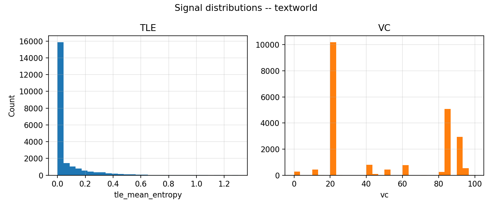
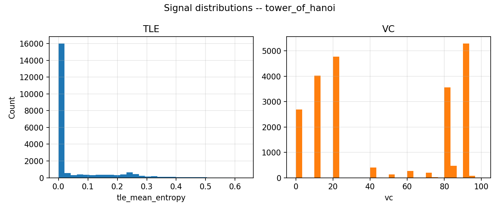
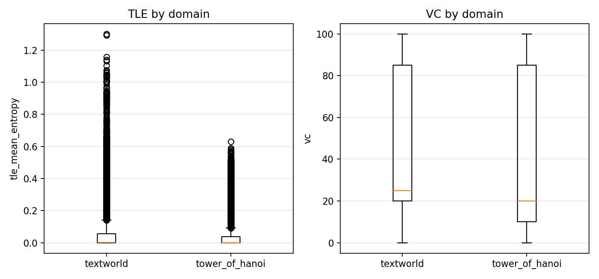
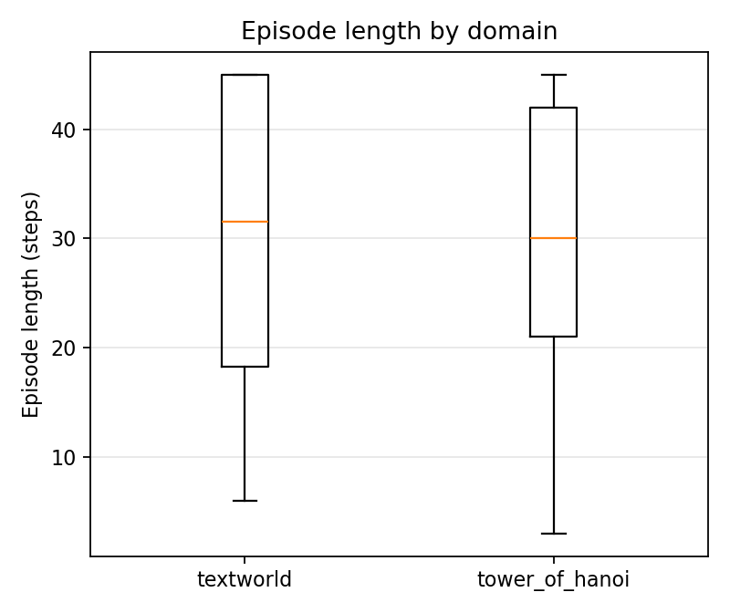

### Full variable codebook

*Table 1*

*Variable roles and measurement scales*

| Variable | Role | Measurement scale | Note |
|---|---|---|---|
| domain | Grouping factor | Nominal (2 levels) | tower_of_hanoi, textworld -- not ordered. |
| compute_stage | Grouping factor / manipulated condition | Ordinal (3 levels) | C0 < C1 < C2 by increasing compute investment, but analyzed as an unordered categorical factor (separate stage-wise z-standardization, ADR-006), not a numeric predictor -- the ordering is conceptual, not used as a linear scale in any model. |
| instance_key | Clustering unit | Nominal (50 levels per domain) | The resampling/clustering unit for cluster_bootstrap and the GEE grouping variable -- not a variable of substantive interest itself. |
| holdout | Design flag | Nominal (binary) | 5 of 50 instances per domain, frozen after Gate D; used for calibrator/threshold fitting, never for confirmatory hypothesis tests on the same steps. |
| tle_mean_entropy (TLE) | Predictor signal | Ratio | Shannon entropy over top-K renormalized logprobs; true zero = complete certainty. Right-skewed, often near-floor (see Table 4) -- analyses use it stage-wise z-standardized, never the raw scale directly. Missing (co-missing with VC) not at random -- see Table 9. |
| vc (VC) | Predictor signal | Interval, by convention -- with a caveat | Self-reported 0-100 confidence, but only 16 distinct values occur in the real data (multiples of 5/10), not a continuous 0-100 scale. Conventionally analyzed as interval/ratio (as the thesis and this pipeline both do), but strictly it is a coarse, self-reported ordinal judgment -- Pearson correlations/OLS-style linear assumptions on it should be read with that caveat in mind (see the Spearman comparison in Table 7). |
| position_norm | Covariate (H3 temporal-degradation axis) | Ratio / interval, deterministic | t / max(episode_length - 1, 1) -- computed exactly from step index and episode length, not measured with error. Its near-uniform distribution (Table 3) is guaranteed by construction, not an empirical finding. |
| y_optimal / task_success | Outcome (dependent variable) | Nominal (binary, Bernoulli) | Step-level (y_optimal) and episode-level (task_success) correctness. Mean = proportion correct; skewness/quantiles are not meaningful for a binary variable and are not reported (see Table 5 instead of Tables 3-4's continuous-variable format). |
| episode_length_steps | Episode-level descriptive / covariate | Ratio (discrete count) | Right-censored at the frozen difficulty-manifest step ceiling (max 45) -- values at the maximum reflect the cap, not necessarily the episode's true difficulty. |
| normalized_compute_cost | Episode-level descriptive | Ratio, bounded [0, 1] by construction | Normalized against the maximum possible compute for that condition. |
| difficulty_tier | Instance-level covariate | Ordinal (observed levels: easy, medium) | Constant ('medium') for every tower_of_hanoi episode -- ToH's frozen manifest (4 disks, one scramble seed) gives no per-instance difficulty variation. Genuinely heterogeneous within textworld (Table 8) -- an asymmetry between domains worth keeping in mind whenever comparing them (H4), since only textworld's instance pool has this extra source of variance. |

*Table 2*

*Sample composition: episodes by domain, compute stage, and holdout status*

| Domain | Stage | Holdout | N episodes |
|---|---|---|---:|
| textworld | C0 | False | 225 |
| textworld | C0 | True | 25 |
| textworld | C1 | False | 225 |
| textworld | C1 | True | 25 |
| textworld | C2 | False | 225 |
| textworld | C2 | True | 25 |
| tower_of_hanoi | C0 | False | 225 |
| tower_of_hanoi | C0 | True | 25 |
| tower_of_hanoi | C1 | False | 225 |
| tower_of_hanoi | C1 | True | 25 |
| tower_of_hanoi | C2 | False | 225 |
| tower_of_hanoi | C2 | True | 25 |

*Note.* Holdout = True are the 5-of-50 instances per domain frozen after Gate D for calibrator/threshold fitting; Holdout = False (45 instances x 5 runs = 225) are used for the confirmatory hypothesis tests.

*Table 3*

*Descriptive statistics for step-level signals, by domain*

| Domain | Variable | N | N missing | M | SD | Min | Mdn | Max | Skewness | Outliers (1.5xIQR) |
|---|---|---:|---:|---:|---:|---:|---:|---:|---:|---:|
| textworld | TLE | 21828 | 1443 | 0.0623 | 0.1315 | 0.0000 | 0.0026 | 1.3010 | 3.30 | 3265 (0.150) |
| textworld | VC | 21828 | 1443 | 49.55 | 32.48 | 0.00 | 25.00 | 100.00 | 0.21 | 0 (0.000) |
| textworld | position_norm | 23271 | 0 | 0.50 | 0.30 | 0.00 | 0.50 | 1.00 | 0.00 | 0 (0.000) |
| tower_of_hanoi | TLE | 21907 | 132 | 0.0522 | 0.1036 | 0.0000 | 0.0000 | 0.6301 | 2.09 | 4527 (0.207) |
| tower_of_hanoi | VC | 21907 | 132 | 45.61 | 36.77 | 0.00 | 20.00 | 100.00 | 0.12 | 0 (0.000) |
| tower_of_hanoi | position_norm | 22039 | 0 | 0.50 | 0.30 | 0.00 | 0.50 | 1.00 | -0.00 | 0 (0.000) |

*Note.* N missing = steps where the variable could not be extracted (e.g. no closed `</think>` block for TLE). TLE = token-level entropy; VC = verbalized confidence (0-100 scale, raw, not yet mapped to a stage-conditional z-score). Outliers = points beyond Q1-1.5xIQR or Q3+1.5xIQR (Tukey fence), count (rate). See Table 1 for measurement-scale caveats.

*Table 4*

*Descriptive statistics for TLE and VC, by domain and compute stage*

| Domain | Stage | Variable | N | M | SD | Skewness |
|---|---|---|---:|---:|---:|---:|
| textworld | C0 | TLE | 8685 | 0.1331 | 0.1737 | 2.11 |
| textworld | C0 | VC | 8685 | 37.80 | 29.42 | 0.92 |
| textworld | C1 | TLE | 6135 | 0.0114 | 0.0485 | 7.53 |
| textworld | C1 | VC | 6135 | 59.59 | 31.15 | -0.34 |
| textworld | C2 | TLE | 7008 | 0.0191 | 0.0640 | 6.15 |
| textworld | C2 | VC | 7008 | 55.31 | 32.74 | -0.08 |
| tower_of_hanoi | C0 | TLE | 7620 | 0.1495 | 0.1272 | 0.61 |
| tower_of_hanoi | C0 | VC | 7620 | 28.82 | 31.94 | 0.95 |
| tower_of_hanoi | C1 | TLE | 7122 | 0.0004 | 0.0107 | 38.22 |
| tower_of_hanoi | C1 | VC | 7122 | 60.19 | 34.30 | -0.55 |
| tower_of_hanoi | C2 | TLE | 7165 | 0.0003 | 0.0070 | 34.27 |
| tower_of_hanoi | C2 | VC | 7165 | 48.95 | 36.86 | -0.00 |

*Note.* Reported per compute stage because the confirmatory H3/H1b models z-standardize TLE/VC within each compute stage separately (ADR-006), not pooled -- a near-zero SD within any single stage row here would invalidate that standardization.

*Table 5*

*Step-level correctness rate (y_optimal), by domain and compute stage*

| Domain | Stage | N | Rate correct | SD |
|---|---|---:|---:|---:|
| textworld | pooled | 23218 | 0.194 | 0.395 |
| textworld | C0 | 8671 | 0.152 | 0.359 |
| textworld | C1 | 7521 | 0.209 | 0.406 |
| textworld | C2 | 7026 | 0.229 | 0.420 |
| tower_of_hanoi | pooled | 22039 | 0.228 | 0.419 |
| tower_of_hanoi | C0 | 7620 | 0.029 | 0.169 |
| tower_of_hanoi | C1 | 7253 | 0.341 | 0.474 |
| tower_of_hanoi | C2 | 7166 | 0.324 | 0.468 |

*Note.* Rate = proportion of steps with the optimal action; SD = sqrt(rate x (1-rate)), the Bernoulli standard deviation implied by the rate, not an independently estimated quantity.

*Table 6*

*Descriptive statistics for episode-level variables, by domain*

| Domain | N episodes | Task success rate | Episode length M (SD) | Compute cost M (SD) |
|---|---:|---:|---:|---:|
| textworld | 750 | 0.537 | 31.03 (13.11) | 0.585 (0.317) |
| tower_of_hanoi | 750 | 0.171 | 29.39 (12.59) | 0.819 (0.320) |

*Note.* M = mean, SD = standard deviation. Task success rate is the raw episode-level success proportion, not the calibrated proxy objective used in policy threshold search.

*Table 7*

*TLE-VC association, by domain*

| Domain | N | Pearson r | p | Spearman rho | p |
|---|---:|---:|---:|---:|---:|
| textworld | 21828 | -0.121 | 0.0000 | -0.340 | 0.0000 |
| tower_of_hanoi | 21907 | -0.343 | 0.0000 | -0.375 | 0.0000 |

*Note.* Both reported because VC's coarse self-report scale (Table 1) makes Pearson's linearity assumption questionable; a Pearson/Spearman gap indicates the association is real but non-linear, not that one estimate is simply wrong. Negative sign is expected: higher TLE (entropy) should co-occur with lower VC (confidence).

*Table 8*

*Instance difficulty tier, by domain*

| Domain | Difficulty tier | N episodes | Task success rate |
|---|---|---:|---:|
| textworld | easy | 450 | 0.589 |
| textworld | medium | 300 | 0.460 |
| tower_of_hanoi | medium | 750 | 0.171 |

*Note.* tower_of_hanoi's frozen manifest (4 disks, single scramble seed) gives every episode the same tier -- no per-instance difficulty variance. textworld's 50 procedurally generated instances land in two tiers with real prevalence; this is a source of variance present in one domain but not the other, relevant whenever comparing domains directly (H4).

*Table 9*

*TLE missingness vs. step outcome, by domain*

| Domain | N present | Rate correct (present) | N missing | Rate correct (missing) |
|---|---:|---:|---:|---:|
| textworld | 21775 | 0.207 | 1443 | 0.000 |
| tower_of_hanoi | 21907 | 0.229 | 132 | 0.000 |

*Note.* Steps with missing TLE (co-missing with VC, see Table 3's identical N-missing counts for both signals) are not a random subset: they have a starkly different correctness rate than steps with the signal present, indicating Missing Not At Random (MNAR), not MCAR. Mechanistically expected, not a data quality defect: a step without a closed `</think>` block or a parseable admissible action has no committed-action tokens to measure TLE on (and no meaningful VC follow-up either) -- there is no confidence to measure for a step the model never resolved into a parseable action. All confirmatory analyses (H1a/H1b/H3) exclude these steps by construction; this table documents that exclusion explicitly rather than leaving it implicit in filter conditions.

## H1a — Discrimination (ΔAUROC(TLE, VC) per domain)

Confirmatory decision: cluster-bootstrapped ΔAUROC lower CI bound > 0, Holm family A (2 domains).

| Domain | ΔAUROC [90% CI] | One-sided p | Holm-adjusted p | Holds |
|--------|------------------|-------------|------------------|-------|
| tower_of_hanoi | 0.0945 [0.0803, 0.1094] | 0.0002 | 0.0004 | True |
| textworld | -0.0009 [-0.0259, 0.0236] | 0.5435 | 0.5435 | False |

Descriptive cross-check (independent code path, no clustering/bootstrap, `compare_signal_calibration`, optimal-only collapse policy):

| Domain | AUROC(TLE) | AUROC(VC) |
|--------|------------|-----------|
| tower_of_hanoi | 0.7134 | 0.6189 |
| textworld | 0.6859 | 0.6868 |


Bootstrap replicate distributions (assumption check: shape/skew of the percentile-bootstrap CI, point estimate falling inside the reported interval):
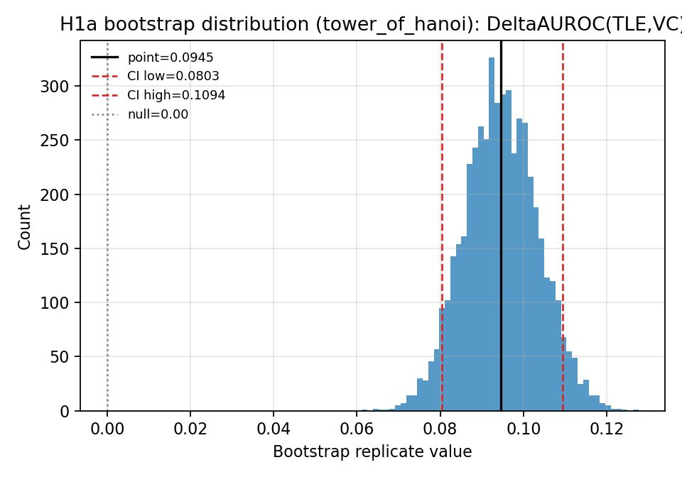
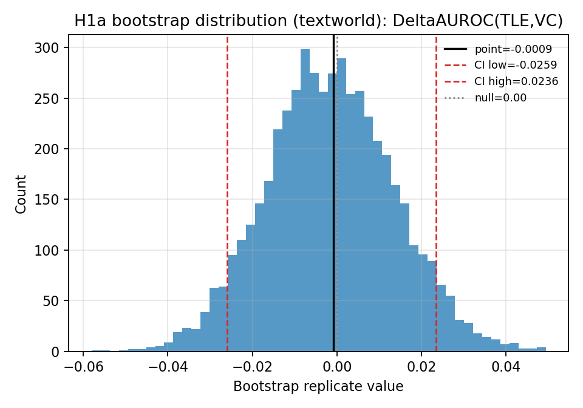

## H1b — Calibration (ΔBrier(TLE-mapped, VC/100) per domain)

Confirmatory decision: cluster-bootstrapped ΔBrier upper CI bound < 0 (lower Brier is better), Holm family D (2 domains). Calibrator (`fit_tle_calibrator`) fit on holdout steps pooled across runs and compute stages, evaluated on non-holdout steps.

| Domain | ΔBrier [90% CI] | Calibrator slope | n holdout steps | Holm-adjusted p | Holds |
|--------|-------------------|-------------------|-------------------|------------------|-------|
| tower_of_hanoi | -0.1510 [-0.1675, -0.1362] | -9.3637 | 2128 | 0.0004 | True |
| textworld | -0.1000 [-0.1131, -0.0878] | -5.1782 | 2398 | 0.0004 | True |

Reliability diagrams (assumption check: does the fitted logistic mapping look sensible against real data, and how does it compare to VC's own reliability?):
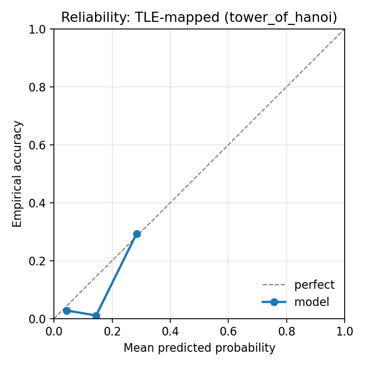
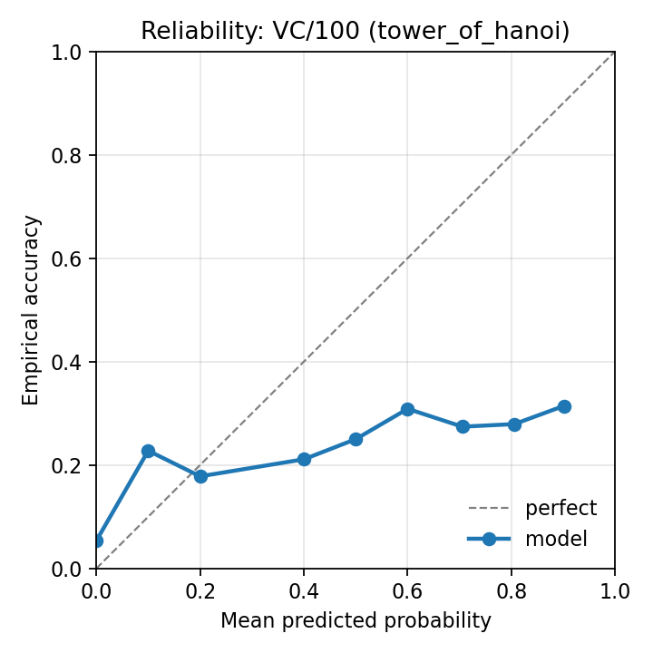
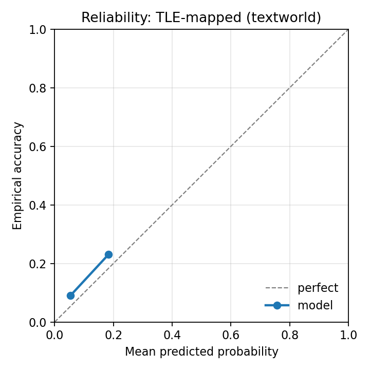
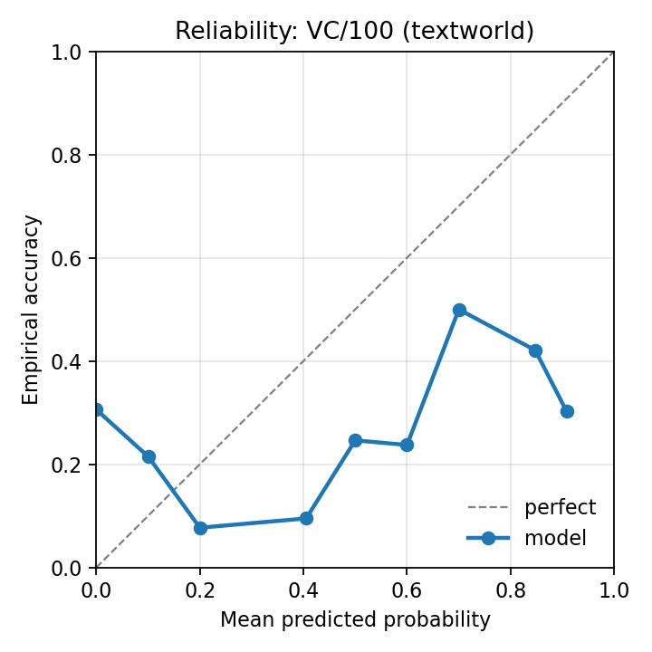

Bootstrap replicate distributions:
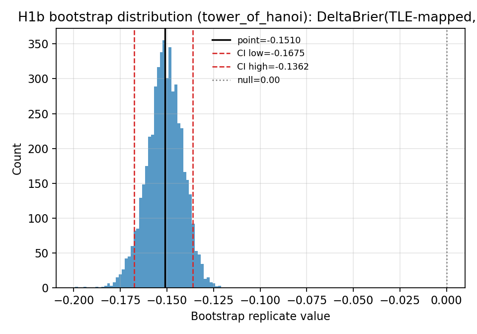
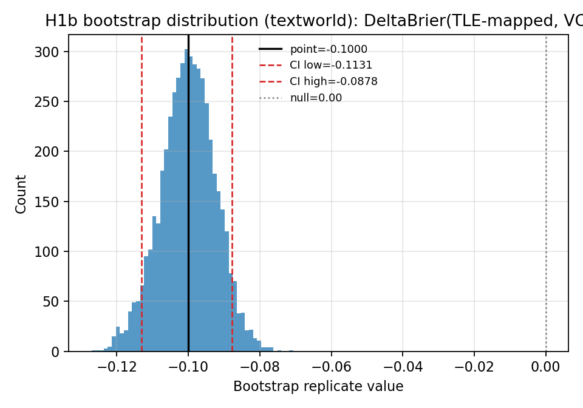

## H3 — Temporal degradation (signal x position_norm interaction)

GEE clustered-logistic interaction coefficient, confirmatory domain = `textworld` (TLE+VC, Holm family E); `tower_of_hanoi` reported exploratory only, not corrected against the confirmatory family. Standard errors use statsmodels' GEE default `cov_type="robust"` (sandwich estimator) -- a misspecified working correlation (Exchangeable, assumed) costs efficiency, not validity.

### Confirmatory (textworld)

| Signal | Interaction coef. | One-sided p (degradation) | Holm-adjusted p | Holds |
|--------|--------------------|-----------------------------|------------------|-------|
| tle | -1.3729 | 0.0000 | 0.0000 | True |
| vc | 0.5991 | 1.0000 | 1.0000 | False |

### Exploratory (tower_of_hanoi, not Holm-corrected)

| Signal | Interaction coef. | Note |
|--------|--------------------|------|
| tle | 0.5955 | exploratory only (short episodes, little positional resolution) -- not corrected against the confirmatory family |
| vc | 0.4849 | exploratory only (short episodes, little positional resolution) -- not corrected against the confirmatory family |

Marginal-effect plots now overlay real, binned empirical data (z_c deciles, mean observed y) alongside the fitted curve -- an assumption check for the linear-in-logit interaction model, not just a visualization of what the model implies:


## H4 — Domain modulation (diff-in-diff of ΔAUROC(ToH) − ΔAUROC(TextWorld))

Confirmatory decision: cluster-bootstrapped (resampled **within each domain independently**, `cluster_bootstrap_stratified`) lower CI bound > 0, single test (Holm family C).

| Diff-in-diff [90% CI] | One-sided p | Holm-adjusted p | Holds |
|------------------------|-------------|------------------|-------|
| 0.0954 [0.0681, 0.1247] | 0.0002 | 0.0002 | True |

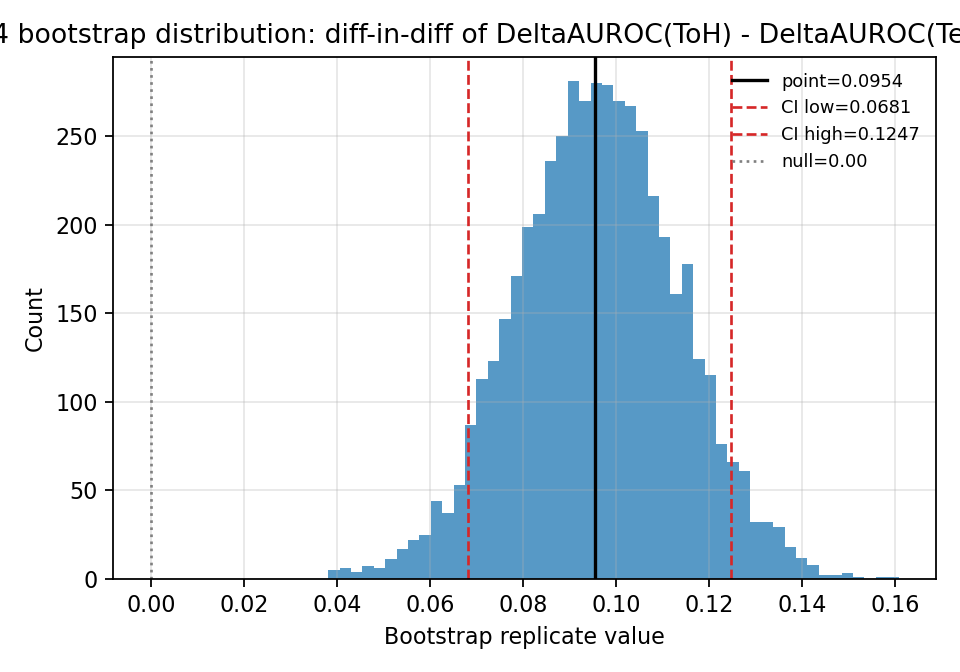

## Verification

- Every stage script is independently runnable, deterministic (fixed `--seed`, default `20260703`), and idempotent -- re-running Stages 0-5 twice on unchanged input data produces byte-identical JSON output (excluding metadata-only fields, none of which carry numeric content here).
- `python -m pytest tests/ -v` green at the time this report was generated.
