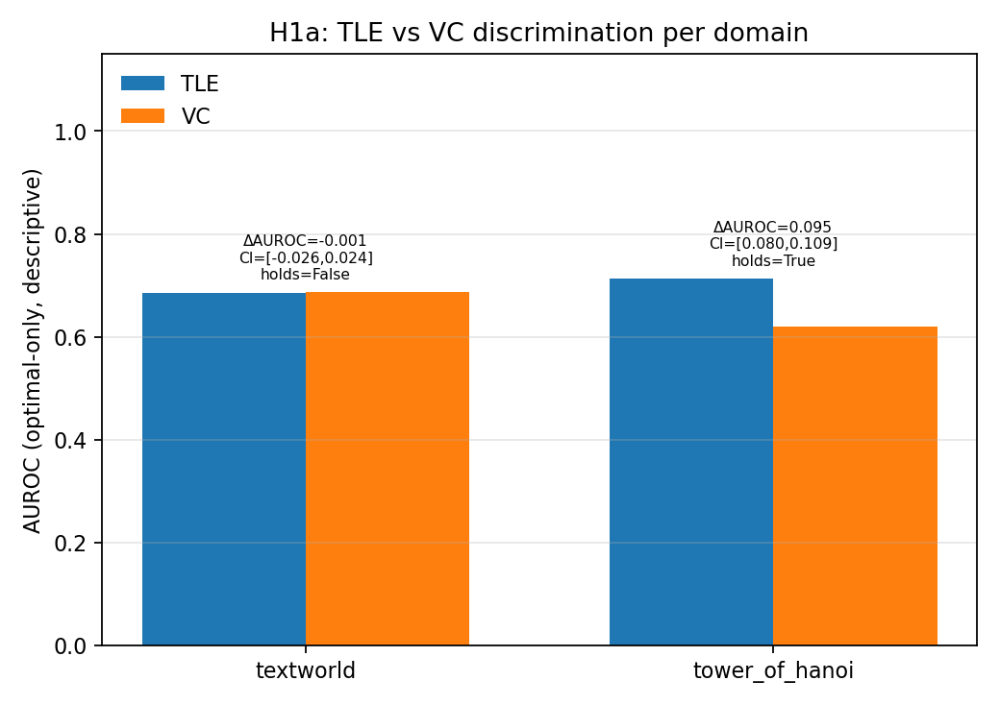
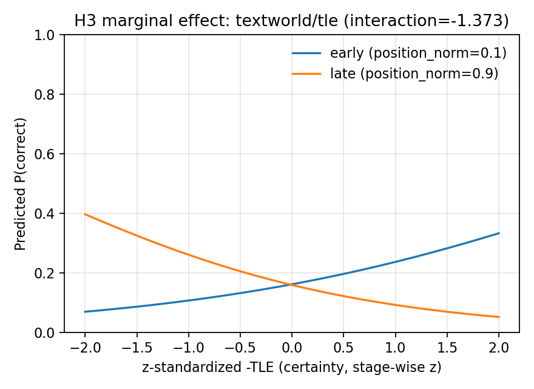
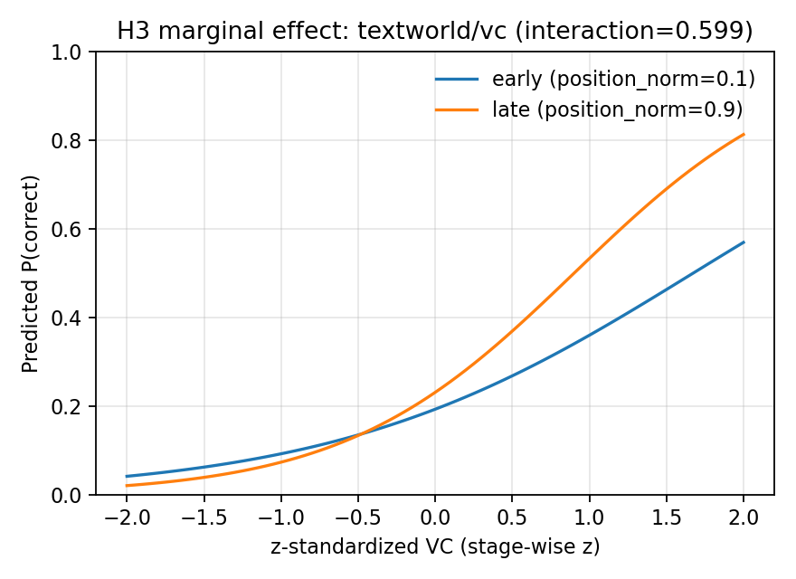
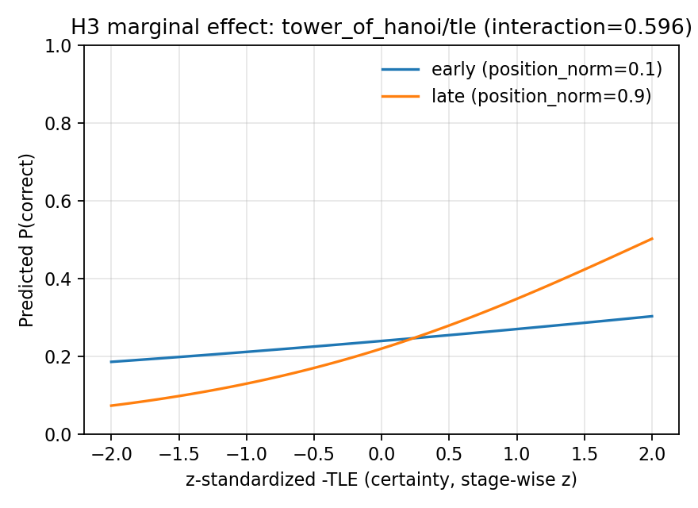
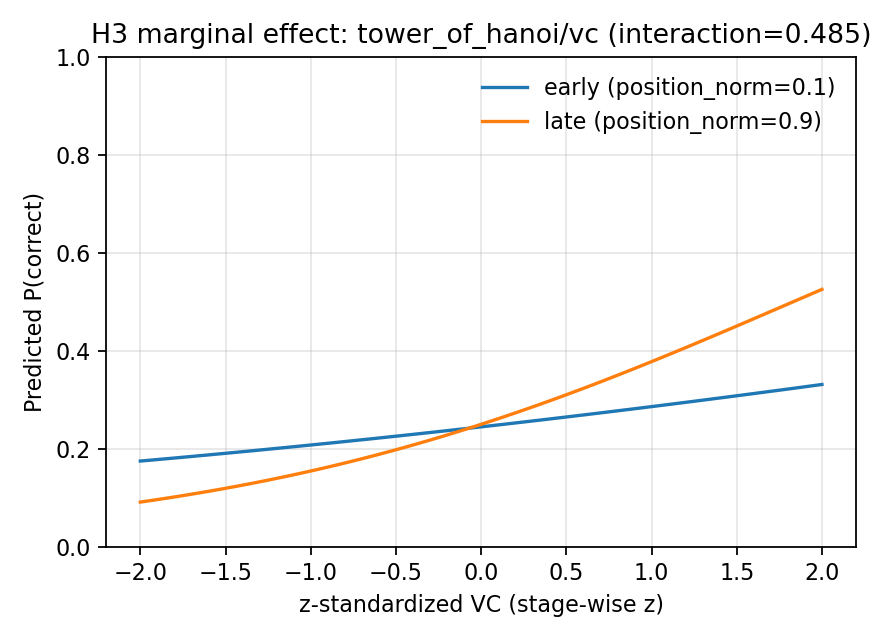

# Phase 1 Real-Data Analysis Report

Generated by `scripts/phase1_analysis/run_all.py` (Stage 7: `stage7_generate_report.py`) from the confirmatory/exploratory pipeline in `scripts/phase1_analysis/`. Re-running the pipeline against unchanged input data reproduces this report byte-for-byte except this header.

## Data source

- Canonical dataset: 1500 episodes (content hash `0fba2f8ff19d88fd...`)
- Selection rule: tower_of_hanoi from data/results/phase1/phase1_20260722_091125 (valid); textworld from data/results/phase1/textworld_regen_20260724 (valid re-collection after commit b47e35d fixed a silent unwinnable-stub fallback that had corrupted 45/50 textworld instances in the 2026-07-22 run's textworld half -- that half is excluded entirely, not merged). See docs/consistency_log.md for the dated entry.

## Reproduce

```bash
python scripts/phase1_analysis/run_all.py
```

## Preanalysis screen (diagnostic, does not gate the confirmatory stages)

| Domain | n steps | n clusters | VC missing rate | ICC (GEE) | Episode length (median, IQR) | Empty position×correctness cells |
|--------|---------|------------|------------------|-----------|------------------------------|-------------------------------------|
| textworld | 23271 | 50 | 0.062 | 0.0361 | 31.5 [18.2, 45.0] | 0 |
| tower_of_hanoi | 22039 | 50 | 0.006 | 0.0134 | 30.0 [21.0, 42.0] | 0 |

## H1a — Discrimination (ΔAUROC(TLE, VC) per domain)

Confirmatory decision: cluster-bootstrapped ΔAUROC lower CI bound > 0, Holm family A (2 domains).

| Domain | ΔAUROC [90% CI] | One-sided p | Holm-adjusted p | Holds |
|--------|------------------|-------------|------------------|-------|
| tower_of_hanoi | 0.0945 [0.0803, 0.1094] | 0.0002 | 0.0004 | True |
| textworld | -0.0009 [-0.0259, 0.0236] | 0.5435 | 0.5435 | False |

Descriptive cross-check (independent code path, no clustering/bootstrap, `compare_signal_calibration`, optimal-only collapse policy):

| Domain | AUROC(TLE) | AUROC(VC) |
|--------|------------|-----------|
| tower_of_hanoi | 0.7134 | 0.6189 |
| textworld | 0.6859 | 0.6868 |



## H1b — Calibration (ΔBrier(TLE-mapped, VC/100) per domain)

Confirmatory decision: cluster-bootstrapped ΔBrier upper CI bound < 0 (lower Brier is better), Holm family D (2 domains). Calibrator (`fit_tle_calibrator`) fit on holdout steps pooled across runs and compute stages, evaluated on non-holdout steps.

| Domain | ΔBrier [90% CI] | Calibrator slope | n holdout steps | Holm-adjusted p | Holds |
|--------|-------------------|-------------------|-------------------|------------------|-------|
| tower_of_hanoi | -0.1510 [-0.1675, -0.1362] | -9.3637 | 2128 | 0.0004 | True |
| textworld | -0.1000 [-0.1131, -0.0878] | -5.1782 | 2398 | 0.0004 | True |

## H3 — Temporal degradation (signal x position_norm interaction)

GEE clustered-logistic interaction coefficient, confirmatory domain = `textworld` (TLE+VC, Holm family E); `tower_of_hanoi` reported exploratory only, not corrected against the confirmatory family.

### Confirmatory (textworld)

| Signal | Interaction coef. | One-sided p (degradation) | Holm-adjusted p | Holds |
|--------|--------------------|-----------------------------|------------------|-------|
| tle | -1.3729 | 0.0000 | 0.0000 | True |
| vc | 0.5991 | 1.0000 | 1.0000 | False |

### Exploratory (tower_of_hanoi, not Holm-corrected)

| Signal | Interaction coef. | Note |
|--------|--------------------|------|
| tle | 0.5955 | exploratory only (short episodes, little positional resolution) -- not corrected against the confirmatory family |
| vc | 0.4849 | exploratory only (short episodes, little positional resolution) -- not corrected against the confirmatory family |






## H4 — Domain modulation (diff-in-diff of ΔAUROC(ToH) − ΔAUROC(TextWorld))

Confirmatory decision: cluster-bootstrapped (resampled **within each domain independently**, `cluster_bootstrap_stratified`) lower CI bound > 0, single test (Holm family C).

| Diff-in-diff [90% CI] | One-sided p | Holm-adjusted p | Holds |
|------------------------|-------------|------------------|-------|
| 0.0954 [0.0681, 0.1247] | 0.0002 | 0.0002 | True |

## Verification

- Every stage script is independently runnable, deterministic (fixed `--seed`, default `20260703`), and idempotent -- re-running Stages 0-5 twice on unchanged input data produces byte-identical JSON output (excluding metadata-only fields, none of which carry numeric content here).
- `python -m pytest tests/ -v` green at the time this report was generated.
